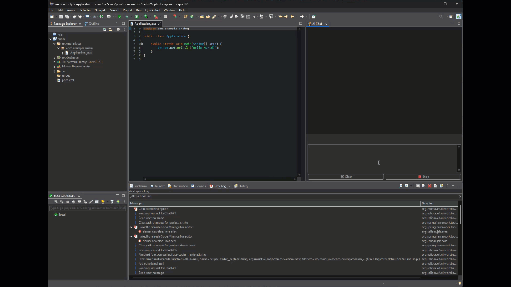
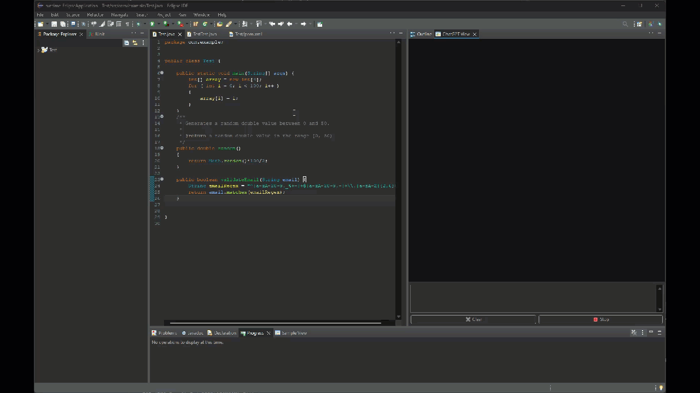
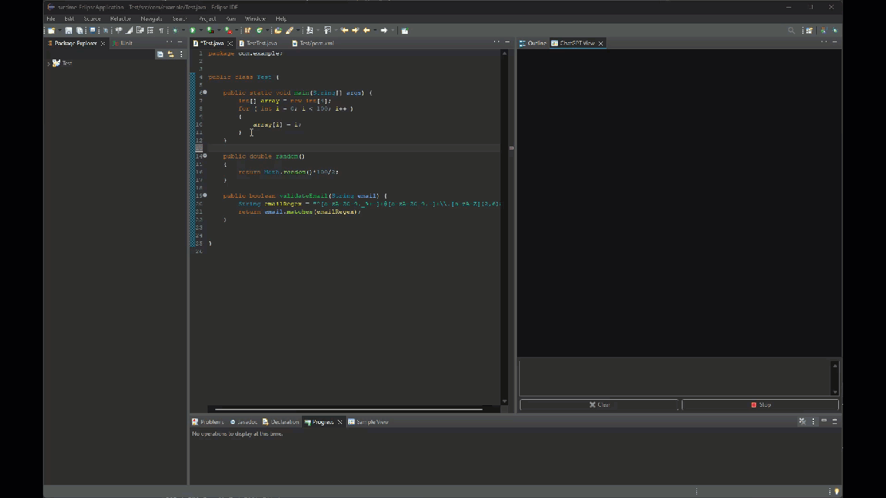
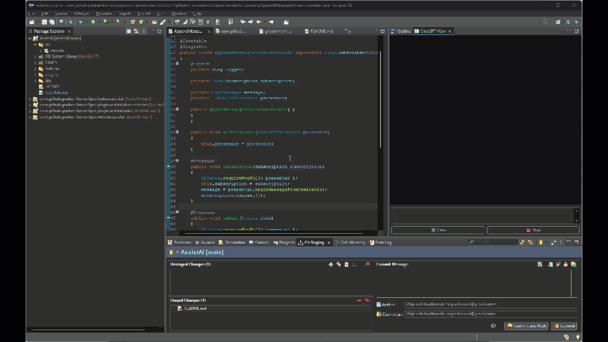
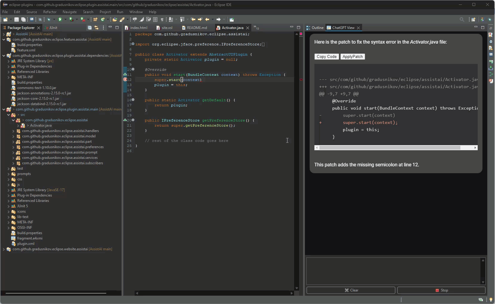
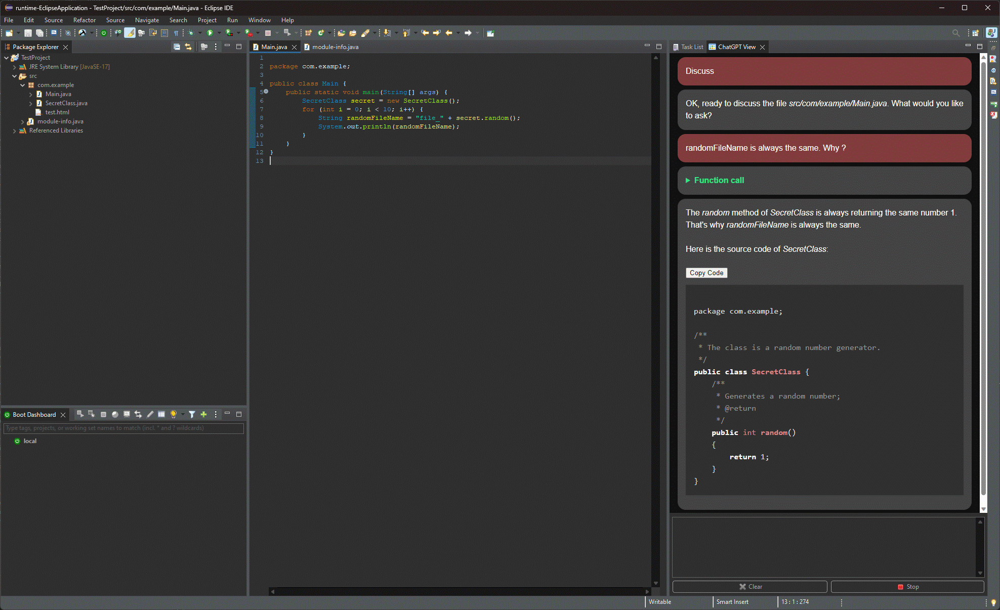
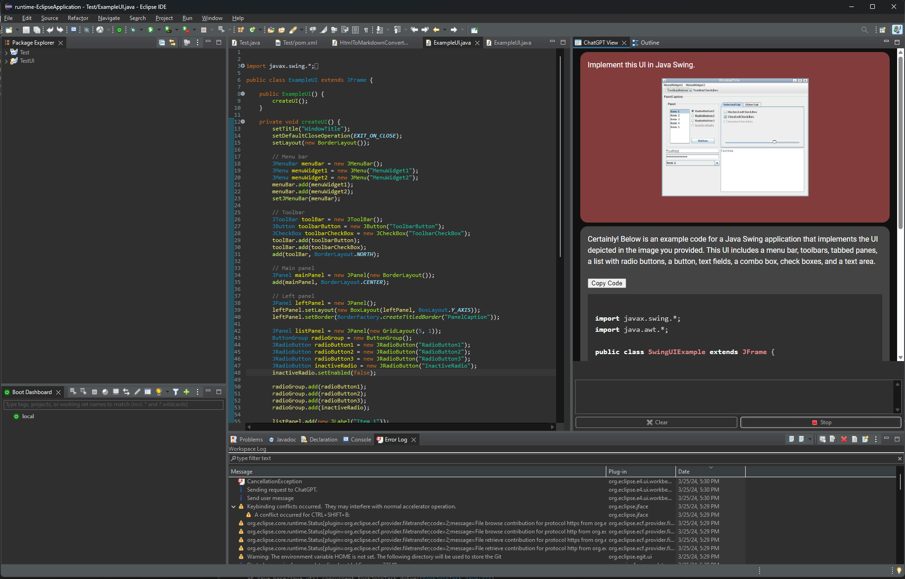
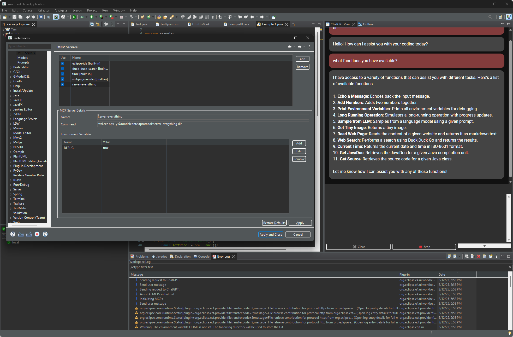

<p align="center"></p>


# AssistAI - A LLM (ChatGPT) Plugin for Eclipse IDE

AssistAI is an Eclipse IDE plugin that brings a Large Language Model (LLM) assistant (similar to ChatGPT) into your development environment. This an experimental plugin..


## Features

- Refactor selected code snippets with LLM
- Generate JavaDoc comments for chosen classes or methods with LLM's help
- Create JUnit tests for selected classes or methods using LLM's assistance
- Engage in a conversation with LLM about the content of the currently opened file
- Fix compilation errors with LLM's guidance
- Copy code blocks generated by LLM to the clipboard
- Produce Git commit comments based on changes in staged files
- Customize pre-defined prompts
- Using the built in tools (MPC) AssistAI can:
  - use JavaDoc or related source code to better understand the context
  - perform a web search using [DuckDuckGo](https://duckduckgo.com/)
  - read a content of a web page
- Create contexts for the LLM that include source files or images 
- Use the vision model to discuss a image content
- Switch between defined LLMs
- [NEW] Added support for interfacing with [Model Context Protocol (MPC)](https://modelcontextprotocol.io/introduction) servers - MCP servers can be used with both OpenAI compatible (gpt-4o, groq, LM studio) and Anthropic (Claude) LLMs
- [NEW] Now supporting both OpenAI and Anthropic protocols - including function/tool calling.
- [NEW] Now you can give control to LLM to modify your project files, access error logs, console output, and more... use Claude, sit back, vibe, and watch them tokens burn


You can also pose general questions to LLM, just like with the regular ChatGPT interface.

## Built-in MCP tools

| MCP Server | Tool | Description |
|------------|------|-------------|
| duck-duck-search | webSearch | Performs a search using a Duck Duck Go search engine and returns the search result json. |
| eclipse-coder | createFile | Creates a new file in the specified project, adds it to the project, and opens it in the editor. |
| eclipse-coder | insertIntoFile | Inserts content at a specific position in an existing file. |
| eclipse-coder | replaceString | Replaces a specific string in a file with a new string, optionally within a specified line range. |
| eclipse-coder | undoEdit | Undoes the last edit operation by restoring a file from its backup. |
| eclipse-coder | createDirectories | Creates a directory structure (recursively) in the specified project. |
| eclipse-ide | formatCode | Formats code according to the current Eclipse formatter settings. |
| eclipse-ide | getJavaDoc | Get the JavaDoc for the given compilation unit. |
| eclipse-ide | getSource | Get the source for the given class. |
| eclipse-ide | getProjectProperties | Retrieves the properties and configuration of a specified project. |
| eclipse-ide | getProjectLayout | Get the file and folder structure of a specified project in a hierarchical format. |
| eclipse-ide | getMethodCallHierarchy | Retrieves the call hierarchy (callers) for a specified method. |
| eclipse-ide | getCompilationErrors | Retrieves compilation errors and problems from the workspace or a project. |
| eclipse-ide | readProjectResource | Read the content of a text resource from a specified project. |
| eclipse-ide | listProjects | List all available projects in the workspace with their detected natures. |
| eclipse-ide | getCurrentlyOpenedFile | Gets information about the currently active file in the Eclipse editor. |
| eclipse-ide | getEditorSelection | Gets the currently selected text or lines in the active editor. |
| eclipse-ide | getConsoleOutput | Retrieves the recent output from Eclipse console(s). |
| memory | think | Use this tool to think about something without obtaining new information or performing changes. |
| webpage-reader | readWebPage | Reads the content of the given web site and returns its content as a markdown text. |
| time | currentTime | Returns the current date and time in the following format: yyyy-MM-dd HH:mm:ss |
| time | convertTimeZone | Converts time from one time zone to another. |


## Context

The plugin leverages the OpenAI API to send predefined prompts to the LLM. These prompts include relevant context from your IDE, such as:

- File name
- Content of the opened file
- Selected class or method name

If you're not satisfied with the results, you can ask follow-up questions to LLM. Your inquiries, along with the complete conversation history, will be sent to LLM, ensuring more precise answers.

Use the "Clear" button to reset the conversation context. Press the "Stop" button to halt LLM's response generation.

## Usage Examples

1. Vibe-coding ;)

   

1. To discuss the class you're working on, select "Discuss" from the "Code Assist AI" context menu and ask any question about the code.



2. To refactor a code snippet, select it and choose "Refactor" from the "Code Assist AI" context menu.


3. You can also ask ChatGPT to document a selected class or method using the "Document" command:


4. Additionally, you can request ChatGPT to generate a JUnit test:



5. After staging all modified files, ask ChatGPT to create a Git commit message:



6. If you have errors in your code, ChatGPT can generate a patch to solve your issues. Select "Fix Errors" command, copy patch contents using the "Copy Code" button, and paste it to your project with CTRL+v, or you can use "Apply Patch" button that will open the patch import window. 

   The "Apply Patch" button is active whenever ChatGPT returns a *diff* code block. When interacting with ChatGPT (i.e. performing a code review) you can ask it to format its answers this way using a following prompt: "Return your answer in diff format using full paths".



7. AssistAI can use function calls to get the related source code or JavaDoc to better understand the problem and provide you with a more accurate solution.



8. Using the context menu Paste an image from a Cliboard or drag-and-drop an image file to discuss it with the ChatGPT. 



9. Configure and use MPC servers. Fill in MCP server details: *name*, *command (CLI)*, *enviromnent variables*, and allow the LLM to use external tools.


## Installation

### Plugin Installation

The easiest way to install the plugin is to use the Eclipse Marketplace. Just drag the "Install" button below into your running Eclipse workspace.

<p align="center"><a href="https://marketplace.eclipse.org/marketplace-client-intro?mpc_install=5602936" class="drag" title="Drag to your running Eclipse* workspace. *Requires Eclipse Marketplace Client"></a></p>

Alternatively you can configure an update site:

1. In Eclipse IDE, open *Help > Install new software*
2. Click the *Add* button to open the "add repository" window, and input `AssistAI` as *Name* and `https://eclipse-chatgpt-plugin.lm.r.appspot.com/` as *Location*
3. Click *Add*
4. Back in *Install* window, choose *AssistAI* from the  *Work with:* list
4. Select "Assist AI" from the plugin list and proceed to the next step by clicking the *Next* button
5. Accept any certificate warnings (note: this is a self-signed plugin, so you will be warned about potential security risks)

### Configuration

After installing the plugin, configure access to the **OpenAI API**:

1. Open *Window > Preferences > Assist AI* preferences
2. Configure your models *Window > Preferences > Assist AI* preferences > Models
   
3. Select the model you want to use from a dropdown list: *Window > Preferences > Assist AI* preferences. You can switch between the defined models here.

### Configuring MCP Servers

MCP servers provide LLMs with tools to interact with files, databases, and APIs. These tools can transform this plugin into an alternative to Cursor or MANUS. Several built-in MCP servers exist, such as DuckDuckGo search, web fetching, or Eclipse integrations, but you can easily add any MCP server that provides a stdio interface.

#### Adding the Filesystem MCP Server
To enable the filesystem MCP (e.g., [filesystem](https://github.com/modelcontextprotocol/servers/tree/main/src/filesystem)), which allows LLMs to read or modify files, follow these steps:

1. **Open the Preferences**  
   Navigate to *Window > Preferences > Assist AI > MCP Servers* and click **Add**.

2. **Configure the Server**  
   Fill in the configuration details:  
   ```  
   Name: server-filesystem  
   Command: wsl.exe npx -y @modelcontextprotocol/server-filesystem ${workspace_loc}  
   ```

3. **Optional Environment Variables**  
   Define environment variables if required (e.g., API keys).

#### Notes
- The `${workspace_loc}` variable specifies the workspace folder accessible to the MCP. When using WSL, this path is automatically converted to a Unix-style path for compatibility.  Other eclipse variables are available (`${project_loc}`, etc.)
- **Security Warning:** Use MCP servers cautiously, as they grant LLMs access to read or modify sensitive data in your project directory, which could be accidentally altered or deleted by the LLM.


### Add ChatGPT View

Add the *ChatGPT View* to your IDE:

1. Open *Window > Show View > Other*
2. Select *ChatGPT View* from the *Code Assist AI* category

