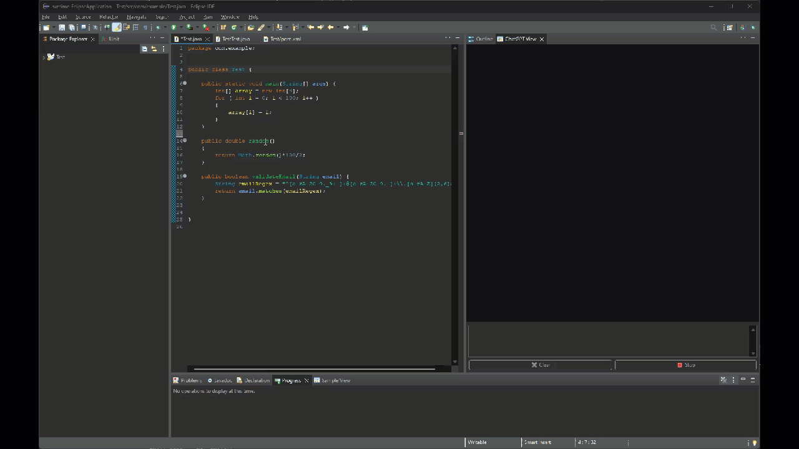

# AssitAI - a ChatGPT plugin for Eclipse IDE

This project is an eclipse IDE plugin that allows integration with ChatGPT. 
The plugin is still very experimental, and it only works with Java editors.

## Main features

1. You can ask ChatGPT to refactor a selected portion of your code
2. You can ask ChatGPT to write a JavaDoc for the selected class or method
3. You can ask ChatGPT to write a JUnit test for the selected class or method
4. Discuss with ChatGPT the content of the currently opened file

You can also ask a question, just like with a regular ChatGPT.

## Context

In the background the plugin will use OpenAI API and send to ChatGPT a pre-defined prompt, which includes the context of your IDE. This may include:

- the file name
- content of the opened file
- selected class or method name

When you are not happy with the result you can always ask additional question to ChatGPT. Your question will be send to ChatGPT along with the the complete conversation history, to help ChatGPT provide you with the most accurate answer.

You can clear the context of the conversation with the "Clear" button. If ChatGPT gets to verbose, you can always stop generating the response with the "Stop" button.

## See how it works

1. Here we want to discuss freely with ChatGPT about the class we are working on. Select "Discuss" from the "Code Assist AI" context menu and ask any question about the code to ChatGPT.

2. Here is a refactoring example. Just select a code snippet you want ChatGPT to refactor and choose "Refactor" from the "Code Assist AI" context menu.

3. You can also ask to document a selected class or method with a "Document" command:

4. Finally you can ask ChatGPT to generate a JUnit test:

## Installation

For the moment binary builds are not provided. You must import this project to your Eclipse as "Plug-ins and Fragments" using the "Plugin Development" import. Then once you have the projct in your workspace, you can export it as "Deployable plug-ins and fragments" and "Install to host" eclipse.

