<p align="center"></p>

# AssistAI - Eclipse IDE as an MCP Server for AI Agents

AssistAI is an Eclipse IDE plugin that exposes your entire development environment as an **MCP (Model Context Protocol) server**. External AI agents — Claude Code, OpenAI Codex, Claude Desktop, or any MCP-compatible client — can read, navigate, edit, build, test, run, and debug your Java projects directly through Eclipse, preserving workspace sync, local history, and incremental compilation.

AssistAI also includes a built-in LLM chat view for quick inline interactions with any supported model.

## Why MCP through Eclipse?

When AI agents edit files through the filesystem directly, Eclipse doesn't know anything changed. Editors show stale content, incremental compilation misses updates, and local history gaps appear.

AssistAI solves this by routing all operations through Eclipse APIs:

- **Edits go through JDT** — incremental compilation fires immediately, errors update in real time
- **Refactorings use Eclipse's refactoring engine** — renames, moves, and package restructures update all references across the workspace
- **File reads reflect the editor buffer** — agents always see the latest unsaved content, not the on-disk version
- **Local history is preserved** — every change is tracked, undoable through Eclipse's local history
- **Tests run inside Eclipse** — JUnit results, console output, and compilation errors are accessible as tool responses

## Getting Started with External Agents

### 1. Enable the HTTP MCP Server

1. Open *Window > Preferences > Assist AI > HTTP MCP Server*
2. Check **Enable HTTP MCP Server**
3. Set **Hostname** and **Port** (defaults: `localhost:8124`)
4. Click **Generate** to create an authentication token
5. Click **Apply** — the server starts immediately

The status panel shows all available endpoints:
- `http://localhost:8124/mcp/eclipse-ide` — code analysis, navigation, search, testing, builds
- `http://localhost:8124/mcp/eclipse-coder` — file editing, refactoring, patching, formatting
- `http://localhost:8124/mcp/eclipse-runner` — launch, debug, breakpoints, stepping
- `http://localhost:8124/mcp/eclipse-context` — resource cache, file local history, version tracking

### 2. Connect Your Agent

#### Claude Code

Add to your Claude Code MCP settings (`.claude/settings.json` or project-level):

```json
{
  "mcpServers": {
    "eclipse-ide": {
      "command": "npx",
      "args": [
        "-y", "mcp-remote", "http://localhost:8124/mcp/eclipse-ide",
        "--allow-http",
        "--header", "Authorization: Bearer YOUR_TOKEN"
      ]
    },
    "eclipse-coder": {
      "command": "npx",
      "args": [
        "-y", "mcp-remote", "http://localhost:8124/mcp/eclipse-coder",
        "--allow-http",
        "--header", "Authorization: Bearer YOUR_TOKEN"
      ]
    },
    "eclipse-runner": {
      "command": "npx",
      "args": [
        "-y", "mcp-remote", "http://localhost:8124/mcp/eclipse-runner",
        "--allow-http",
        "--header", "Authorization: Bearer YOUR_TOKEN"
      ]
    }
  }
}
```

> On Windows with WSL, use `"command": "wsl"` and prepend `"npx"` to the args array.

#### Claude Desktop

Add to your Claude Desktop configuration file:
- Windows: `%APPDATA%\Roaming\Claude\claude_desktop_config.json`
- macOS: `~/Library/Application Support/Claude/claude_desktop_config.json`
- Linux: `~/.config/Claude/claude_desktop_config.json`

Use the same `mcpServers` format as above.

#### OpenAI Codex / Other MCP Clients

Any client that supports MCP over Streamable HTTP can connect directly to the endpoint URLs. Use the `Authorization: Bearer <token>` header for authentication.

### 3. What Agents Can Do

With the MCP tools, an external agent can:

- **Read and navigate code** — project layout, class outlines, method source, type hierarchies, call hierarchies, find references
- **Edit code** — create files, apply unified diffs, replace strings, delete lines, replace entire files
- **Refactor** — rename types/packages, move types, organize imports — all through Eclipse's refactoring engine
- **Build and test** — run Maven builds, execute JUnit tests (all, by package, class, or method), read compilation errors, get quick-fix suggestions
- **Search** — text search, regex search, file glob search, search-and-replace across the workspace
- **Run and debug** — launch Java applications, set breakpoints (including conditional), step through code, inspect stack traces, evaluate expressions, hot-swap code
- **Access context** — read JavaDoc, console output, editor selection, effective POM, project dependencies
- **Browse and restore file history** — list Local History versions, view old content, restore to any previous version, diff current vs. historical
- **Inspect the resource cache** — see what files/classes are loaded in the conversation context, read cached content without I/O

### 4. Guiding Agents with Eclipse Context

External agents don't know what you're looking at in Eclipse — unless they ask. AssistAI provides MCP tools that let agents pick up context from your IDE session, so you can guide their work by simply opening files, selecting code, or running programs:

| What you do in Eclipse | Tool the agent calls | What the agent sees |
|------------------------|---------------------|---------------------|
| Open a file in the editor | `getCurrentlyOpenedFile` | Full file content with path, project name, and line numbers |
| Select a code region | `getEditorSelection` | Selected text with start/end line numbers and surrounding file context |
| Run or debug a program | `getConsoleOutput` | Recent stdout/stderr from Eclipse console(s) |
| Have compilation errors | `getCompilationErrors` | All errors/warnings with file, line, and message |
| Open a specific class | `getClassOutline` | Compact structure — fields, method signatures, line numbers |

**Workflow tip:** When asking an agent to fix something, open the relevant file in Eclipse first, select the problem area, and tell the agent to check your selection. This gives the agent precise context without you having to describe file paths or paste code.

**Token-efficient navigation:** Instead of reading entire files, agents can use `getClassOutline` to see the structure (~30 lines for a 500-line class), then `getMethodSource` to read only the methods they need, or `getFilteredSource` to see the full file with irrelevant methods collapsed to one-line signatures. The `readProjectResource` tool supports `excludeImports` to further reduce token usage.

**Resource cache:** Files and classes read through Eclipse MCP tools are automatically cached with version tracking and file modification timestamps (tied to Eclipse's Local History). Agents can call `listCachedResources` to see what's already loaded, or `getCachedResource` to re-read cached content instantly — no disk I/O, no re-parsing.

**Local History:** Eclipse automatically maintains a Local History for every file modified through the IDE. Agents can browse past versions (`getFileHistory`), read historical content (`getFileHistoryContent`), compare with the current version (`compareWithHistory`), or restore to any previous state (`restoreFileVersion`). This is more powerful than a simple undo — it preserves every edit across the entire session, including changes made by the agent itself.


## MCP Tool Reference

### eclipse-coder — Code Editing

| Tool | Description |
|------|-------------|
| createFile | Creates a new file, adds it to the project, and opens it in the editor |
| insertIntoFile | Inserts content at a specific position in an existing file |
| replaceString | Replaces a specific string in a file, optionally within a line range |
| applyPatch | Applies a unified diff patch with fuzzy context matching — preferred for multi-hunk edits |
| formatFile | Formats a Java file using Eclipse's code formatter |
| undoEdit | Restores a file from its backup (undo last edit) |
| createDirectories | Creates a directory structure recursively |
| renameFile | Renames a file in a project |
| deleteFile | Deletes a file from a project |
| replaceFileContent | Replaces the entire content of a file |
| deleteLinesInFile | Deletes a range of lines (1-based indexing) |
| refactorRenameJavaType | Renames a Java type using Eclipse's refactoring, updating all references |
| refactorMoveJavaType | Moves a Java type to a different package, updating all references |
| refactorRenamePackage | Renames a package, updating all declarations and references |
| moveResource | Moves a file or folder to a different location |
| organizeImports | Organizes imports in a Java file (Ctrl+Shift+O equivalent) |
| organizeImportsInPackage | Organizes imports in all Java files within a package |

### eclipse-ide — Code Analysis, Navigation & Build

| Tool | Description |
|------|-------------|
| getSource | Full source of a class |
| getClassOutline | Compact class outline — declarations and method signatures (no bodies) with line numbers |
| getMethodSource | Source of specific methods by name, with overload disambiguation |
| getFilteredSource | Full source with non-selected methods collapsed to signatures |
| readProjectResource | Read a text resource, with optional import block collapsing |
| getJavaDoc | JavaDoc for a compilation unit |
| formatCode | Format code using Eclipse formatter settings |
| getProjectProperties | Project properties and configuration |
| getProjectLayout | File/folder structure with `scopePath` and `maxDepth` support |
| listProjects | All workspace projects with detected natures |
| listMavenProjects | All Maven projects in the workspace |
| getCurrentlyOpenedFile | Currently active file in the editor |
| getEditorSelection | Selected text or lines in the active editor |
| getConsoleOutput | Recent Eclipse console output |
| getMethodCallHierarchy | Call hierarchy (callers) for a method |
| getTypeHierarchy | Type hierarchy (supertypes, interfaces, subtypes) |
| findReferences | All references to a type, method, or field across the workspace |
| getCompilationErrors | Compilation errors from the workspace or a project |
| getQuickFixes | Available quick fixes for compilation errors |
| getImportSuggestions | Import candidates for unresolved types |
| fileSearch | Substring search in workspace files |
| fileSearchRegExp | Regex search in workspace files |
| findFiles | Glob pattern file search |
| searchAndReplace | Search and replace across multiple files |
| runAllTests | Run all tests in a project |
| runPackageTests | Run tests in a specific package |
| runClassTests | Run tests for a specific class |
| runTestMethod | Run a specific test method |
| findTestClasses | Find all test classes in a project |
| runMavenBuild | Run a Maven build with specified goals |
| getEffectivePom | Effective POM for a Maven project |
| getProjectDependencies | Maven project dependencies |

### eclipse-runner — Launch, Debug & Breakpoints

| Tool | Description |
|------|-------------|
| runJavaApplication | Launch in run mode with optional arguments and timeout |
| debugJavaApplication | Launch in debug mode, stops at breakpoints |
| stopApplication | Stop a running/debugging application |
| listActiveLaunches | List all running/debugging applications |
| toggleBreakpoint | Set or remove a line breakpoint |
| setConditionalBreakpoint | Breakpoint with condition expression and optional hit count |
| listBreakpoints | List all breakpoints with status and conditions |
| removeAllBreakpoints | Remove all breakpoints |
| getStackTrace | Stack trace of all threads with local variables |
| evaluateExpression | Evaluate a Java expression in a suspended debug frame |
| resumeDebug | Resume execution of a suspended session |
| stepOver | Step over the current line |
| stepInto | Step into the method call |
| stepReturn | Step out of the current method |
| hotCodeReplace | Push code changes into a running debug session without restarting |

### eclipse-context — Resource Cache & Local History

| Tool | Description |
|------|-------------|
| listCachedResources | Lists all resources in the conversation cache — URIs, types, versions, timestamps, token estimates |
| getCachedResource | Gets cached resource content by URI without disk I/O |
| getCacheStats | Cache statistics: resource count, token usage, limits |
| getFileHistory | Lists Local History versions of a file with timestamps and sizes |
| getFileHistoryContent | Reads the content of a specific Local History version |
| restoreFileVersion | Restores a file to a specific Local History version |
| compareWithHistory | Shows a unified diff between current content and a historical version |

### Utility Servers

| Server | Tool | Description |
|--------|------|-------------|
| duck-duck-search | webSearch | Web search via DuckDuckGo |
| memory | think | Scratchpad for reasoning without side effects |
| webpage-reader | readWebPage | Fetch a web page and return it as markdown |
| time | currentTime | Current date and time |
| time | convertTimeZone | Convert time between time zones |


## Configuration

### Per-Server Tool Filtering

Each MCP server can have individual tools enabled or disabled to reduce token overhead or exclude irrelevant tools.

1. Navigate to *Window > Preferences > Assist AI > MCP Servers*
2. Select a server (works for both built-in and user-defined)
3. In the **Tools** section, uncheck tools you want to exclude

Changes take effect immediately — both the internal MCP client and the HTTP server restart automatically. Excluded tools won't appear in `tools/list` responses.

### Adding External MCP Servers

AssistAI is also an MCP *client* — you can connect external MCP servers (stdio-based) and use their tools through any of the supported LLMs.

1. Open *Window > Preferences > Assist AI > MCP Servers* and click **Add**
2. Configure the server:
   ```
   Name: server-filesystem
   Command: npx -y @modelcontextprotocol/server-filesystem ${workspace_loc}
   ```
3. Define environment variables if needed (e.g., API keys)

The `${workspace_loc}` variable resolves to the workspace folder. Other Eclipse variables are available (`${project_loc}`, etc.).

> **Security:** MCP servers grant LLMs access to read and modify data. Use them cautiously.

### HTTP MCP Server Security

- **Local network only** by default — only expose externally if necessary
- **Authentication token** — always use one when exposing beyond localhost
- **Firewall rules** — allow connections only from trusted sources
- **HTTPS** — consider a reverse proxy with TLS for production use
- **Access control** — connected agents have access to all tools on enabled endpoints


## Built-in Chat View

AssistAI includes a built-in LLM chat panel for direct interaction without external agents. Open it via *Window > Show View > Other > Code Assist AI > AssistAI Chat*.

Features:
- Refactor, document, or generate tests for selected code via context menu
- Fix compilation errors with LLM guidance
- Discuss code with full file context
- Generate git commit messages from staged changes
- Drag-and-drop images for vision model discussions
- LaTeX and table rendering in responses
- In-text code completion with Alt+/
- Smart resource caching — LLM always sees the latest version of attached files
- Customizable pre-defined prompts
- Switch between models on the fly

### Supported Models

| Provider | Protocol | Sample Models | MCP / Tools | Vision |
|----------|----------|--------------|-------------|--------|
| OpenAI | OpenAI API | gpt-5 | Yes | Yes |
| Anthropic | Claude API | claude-sonnet-4-5-20250929 | Yes | Yes |
| Google | Gemini API | gemini-2.5-flash, gemini-3-pro-preview | Yes | Yes |
| Grok | Grok API | grok-4, grok-code-fast | Yes | Yes |
| Groq | OpenAI API | qwen-qwq-32b, llama3-70b-8192 | Yes | Yes |
| DeepSeek | DeepSeek API | deepseek-chat | Yes | No |
| Local/Self-hosted | OpenAI API | Ollama, LM Studio, etc. | Varies | Varies |
| Other 3rd party | OpenAI API | Together.ai, Anyscale, etc. | Varies | Varies |

Configure models in *Window > Preferences > Assist AI > Models*.


## Screenshots

1. claude-code controlling the Eclipse IDE via MCP

    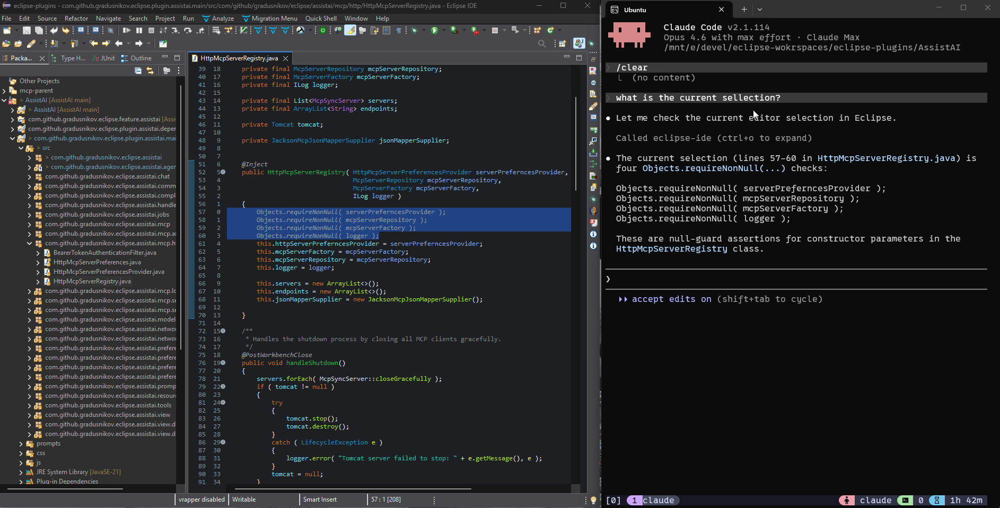

2. Agentic coding with Eclipse MCP tools

   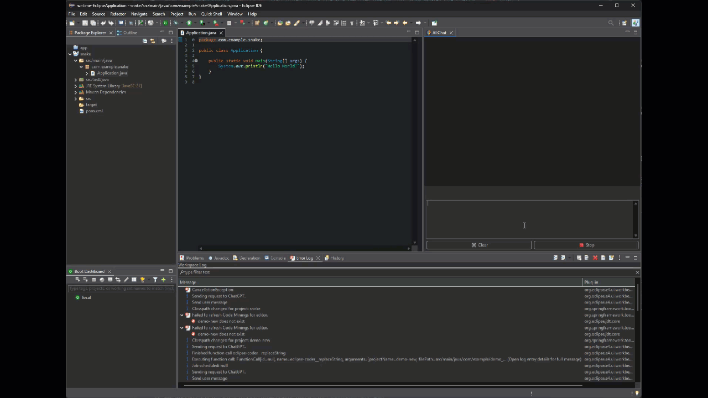

3. Discussing code in the built-in chat

   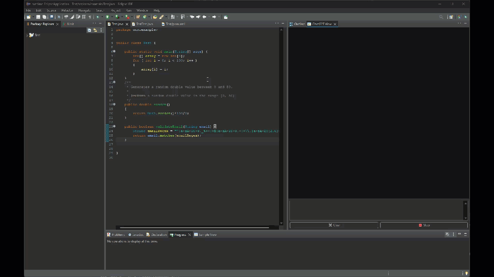

4. Refactoring selected code

   

5. Generating documentation

   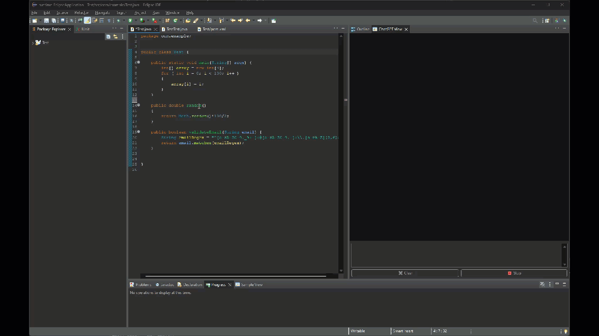

6. Generating JUnit tests

   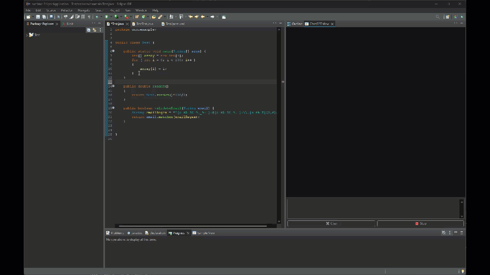

7. Git commit message generation

   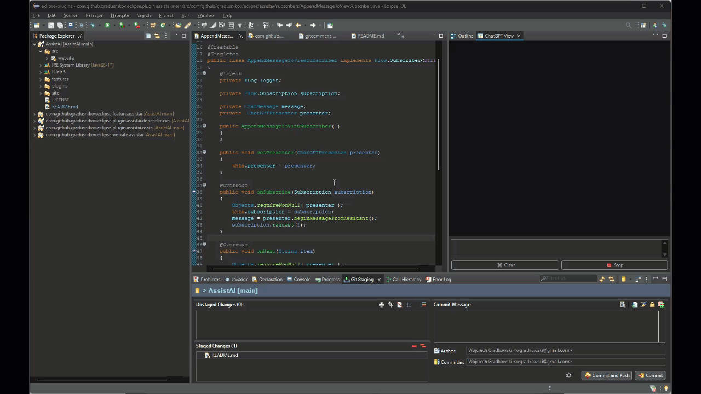

8. Fixing compilation errors with patches

   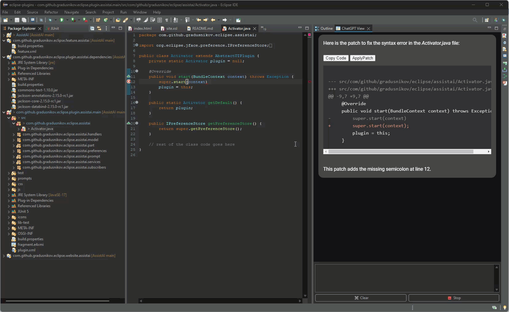

9. Tool calls for context-aware answers

   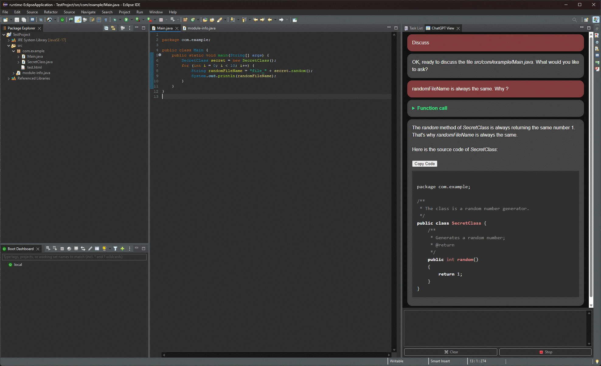

10. Vision model — discuss images

   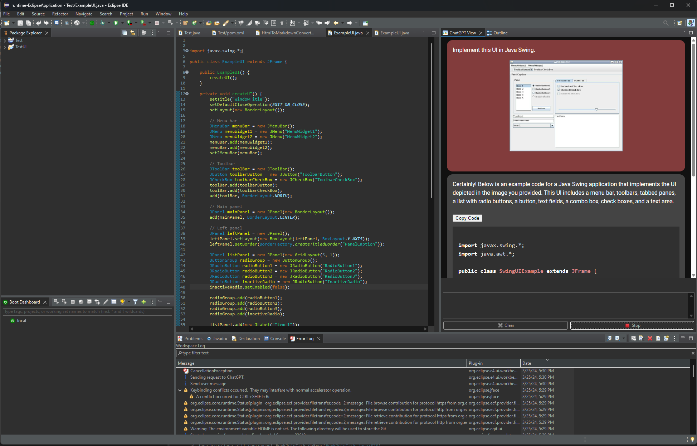

11. LaTeX and table rendering

    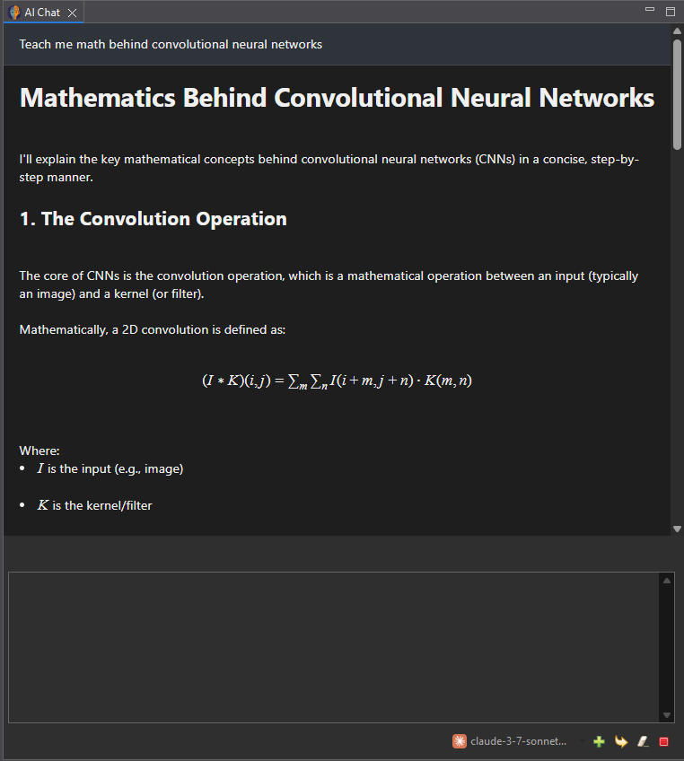

12. Configuring MCP servers

    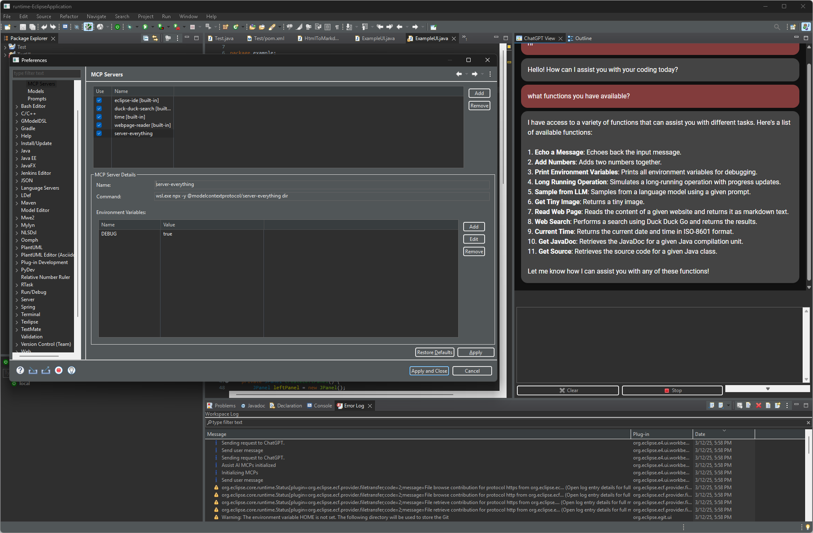


## Installation

### Eclipse Marketplace

Drag the button below into your running Eclipse workspace:

<p align="center"><a href="https://marketplace.eclipse.org/marketplace-client-intro?mpc_install=5602936" class="drag" title="Drag to your running Eclipse* workspace. *Requires Eclipse Marketplace Client"></a></p>

### Update Site

1. In Eclipse, open *Help > Install New Software*
2. Click *Add*, enter `AssistAI` as Name and `https://gradusnikov.github.io/eclipse-chatgpt-plugin/` as Location
3. Select "Assist AI" from the plugin list and proceed through the wizard
4. Accept certificate warnings (self-signed plugin)

### Initial Setup

1. Open *Window > Preferences > Assist AI*
2. Configure your models in *Preferences > Assist AI > Models*
3. To use with external agents, enable the HTTP MCP Server (see above)
